  

  
  &nbsp;&nbsp;
  
  &nbsp;&nbsp;
  

---

### About Me

Software engineer focused on cloud data platforms, ETL pipelines, and analytics-ready datasets. Currently building and optimizing Java, Python, Spring Boot, and SQL workflows at a financial services company, with plenty of Google Cloud in the mix.

- :cloud: Building cloud-based ETL applications with **GCP, Terraform, Apache Beam, Dataflow, BigQuery, Pub/Sub, and Cloud Composer**
- :bar_chart: Turning high-volume raw data into reliable datasets for analytics and reporting
- :mortar_board: TCU alum with a **B.S. in Computer Science** and **B.B.A. in Business Information Systems**
- :school: Starting the **MSAI program at UT Austin** in Fall 2026
- :medal_sports: Certified <a href="https://www.credly.com/badges/df72e9eb-9d7a-4086-9d2f-5869047158d4" target="_blank" rel="noopener noreferrer"><b>Google Cloud Professional Cloud Architect</b></a> and <a href="https://www.credly.com/badges/bb23de26-0cb2-4f1a-ace7-424af8bc3c18/" target="_blank" rel="noopener noreferrer"><b>AWS Developer - Associate</b></a>
- :telescope: Currently studying **AI, Machine Learning, and Deep Learning**
- :sparkles: For a fun read, browse <a href="https://hungngdoan.github.io/hung-blog/" target="_blank" rel="noopener noreferrer"><b>H&#432;ng's Journal</b></a>, my casual space for reflections, creative notes, and off-hours writing
- :fish: Still happy to talk about tropical fish. Seriously.

---

### Tech Stack

  
  
  
  
  
  

> :point_up: More badges incoming as I ship more projects. No empty flexes here.

---

### Cloud Technologies

  
  
  
  

---

### AI & Applied ML

  
  
  
  
  

<table>
  <tr>
    <td width="33%" valign="top">
      <b>Learning Track</b> 
      AI fundamentals, machine learning workflows, deep learning, and practical model evaluation.
    </td>
    <td width="33%" valign="top">
      <b>Data-to-AI Bridge</b> 
      Turning reliable cloud pipelines into clean, model-ready datasets for analytics and experimentation!
    </td>
    <td width="33%" valign="top">
      <b>Tooling I Am Exploring</b> 
      Python notebooks, feature engineering, experiment tracking, and production-minded ML patterns.
    </td>
  </tr>
</table>

  
  
  
  

---

### MSAI Prep Journey

  
  

Tracking my preparation for the **UT Austin MSAI program** through AI fundamentals, math refreshers, programming practice, study notes, and learning milestones.

---

### Project List

<table>
  <tr>
    <th align="left">Project</th>
    <th align="left">Focus</th>
    <th align="left">Status</th>
  </tr>
  <tr>
    <td><b><a href="https://github.com/hungngdoan/opus-rewrap">opus-rewrap</a></b> Audio container repair tool</td>
    <td>opus-rewrap fixes .opus files that contain Opus audio in the wrong container, usually WebM/Matroska files renamed to .opus. It remuxes them into real Ogg/Opus with <code>ffmpeg -c copy</code>, so there is no re-encoding and no quality loss.  This tool is only for .opus files. It does not process MP3 files or convert MP3 to Opus.</td>
    <td></td>
  </tr>
  <tr>
    <td><b>AI Learning Lab</b> Portfolio project placeholder</td>
    <td>Applied ML experiments, model evaluation, and notebook-to-code practice</td>
    <td></td>
  </tr>
  <tr>
    <td><b>Full-Stack Analytics App</b> Portfolio project placeholder</td>
    <td>Java, Spring Boot, Python, SQL, dashboards, and clean data contracts</td>
    <td></td>
  </tr>
</table>

---

### GitHub Stats

  
  

  

---

  <i>"The Tessaiga is a sword meant to protect humans. My code is... getting there." </i> :fish::crossed_swords:

